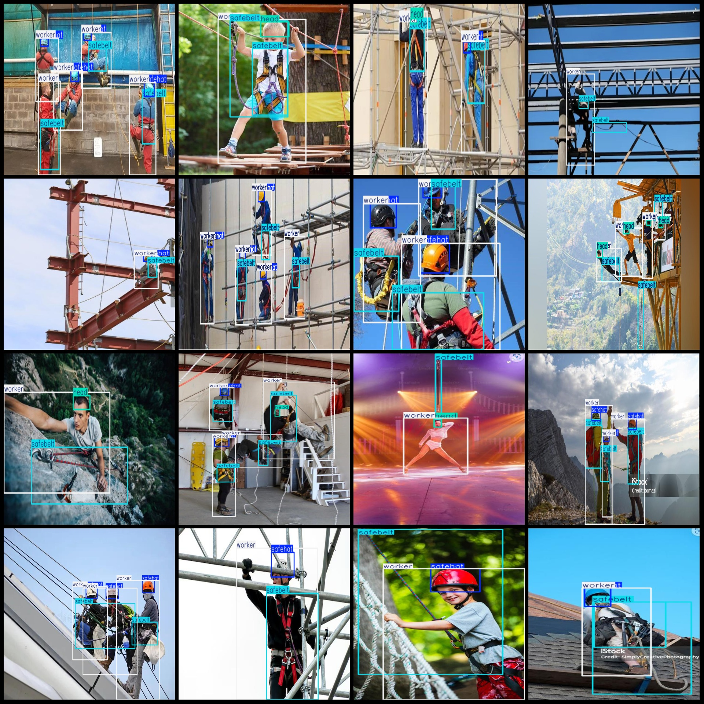
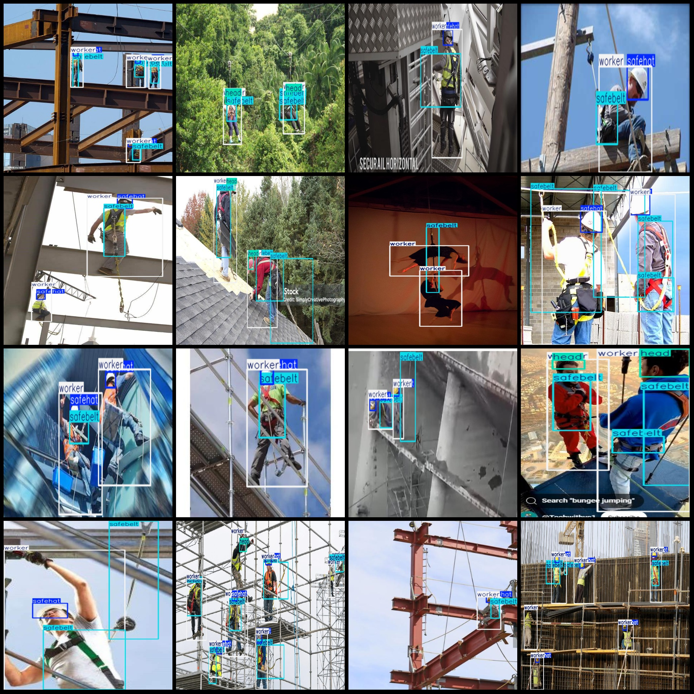

# Aerial Work Safety Belt and Headgear Inspection Data Set VOC+YOLO Format with 110 Images in 4 Categories

Dataset format: Pascal VOC format + YOLO format (without split path in the txt file, only containing jpg images and corresponding VOC format xml files and yolo format txt files)

Number of images (jpg file count): 110
Number of annotations (xml file count): 110
Number of annotations (txt file count): 110
Number of annotation categories: 4
Annotation category names (note that the order of categories in the yolo format does not match this, but is based on the labels folder classes.txt): ["head", "safebelt", "safehat", "worker"]
Each category has the number of boxes:
head (head) box count = 55
safebelt (safe belt) box count = 257
safehat (safe hat) box count = 160
worker (worker) box count = 230
Total box count: 702
Image resolution: Multi-resolution images, such as 804x351, 640x640, etc.
Using labeling tool: labelImg
Labeling rules: Drawing a rectangle box for each category.
Important note: The dataset does not have been split into training, validation, or test sets; please divide it yourself.
Special declaration: This dataset does not guarantee the accuracy of the trained model or weight files.
Image preview:
Annotation example:
## Images

Here is a pay link on Stripe ( https://buy.stripe.com/3cs8yP7sY87d0vu9AB ). Please contact me lonlonago@foxmail.com after funding $89, and I will send you a complete data files , thank you!

